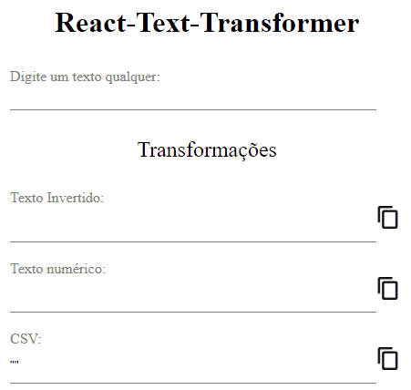

# React-Text-Transformer

Site que gera textos formatados a partir de uma entrada.

Formatos gerados:
 - Texto Invertido
 - Texto numérico
 - CSV
 - Slug
 - Somente vogais
 - Somente consoantes
 - camelCase

  

